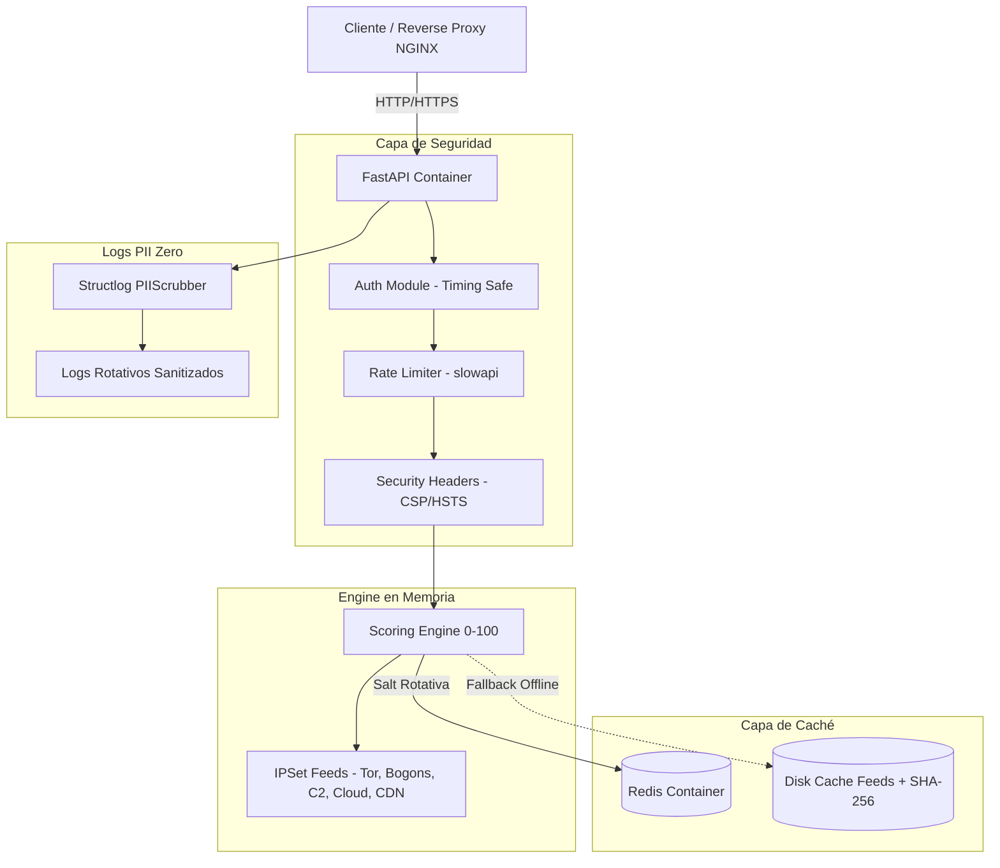

# Arquitectura de Sistema, Ciberseguridad y Privacidad (Architecture & Security Specification)

Documentación de arquitectura técnica, modelo de scoring explicable, mecanismos de privacidad **PII Zero**, endurecimiento de infraestructura y matriz de cumplimiento normativo (GDPR & LFPDPPP México).

---

## 🏛️ 1. Arquitectura General y Flujo de Datos



---

## 🛡️ 2. Principios de Privacidad PII Zero & Security by Design

### A. Proceso Efímero de Datos (Data Ephemerality)
- **Recibir → Analizar → Responder → Destruir**: Ninguna dirección IP individual recibida en los endpoints de evaluación es guardada en disco, base de datos ni archivos de registro.
- **Sin Persistencia Relacional**: No se utiliza base de datos relacional (PostgreSQL/MySQL) que almacene logs de navegación o historial de consultas por IP.

### B. Anonimización Criptográfica con Salt Rotativa en Caché Redis
Para evitar volver a calcular el score de una misma IP durante su ventana TTL sin exponer la IP en caché:
- La clave en Redis se genera aplicando un digest **SHA-256** combinando una salt secreta, la fecha UTC actual y la IP:
  ```python
  cache_key = f"ip_score:{sha256(SALT_SECRET + YYYY-MM-DD + IP).hexdigest()}"
  ```
- **Rotación Diaria Automática**: Al cambiar la fecha UTC (`YYYY-MM-DD`), la clave resultante cambia completamente. Esto significa que **las claves almacenadas en Redis quedan inutilizadas criptográficamente cada 24 horas**, impidiendo cualquier intento de reconstrucción histórica o trazabilidad de IPs.

### C. Sanitización Automática de Logs (`PIIScrubber`)
El middleware de logging estructurado (`structlog`) integra el filtro `PIIScrubber`:
- Escanea mediante expresiones regulares cualquier patrón de dirección **IPv4** (ej. `192.168.1.1` → `[REDACTED_IP]`) e **IPv6** (ej. `2001:db8::1` → `[REDACTED_IPV6]`).
- Garantiza que ni en la consola de la aplicación ni en los archivos de log en disco (`data/logs/ip_score.log`) se escriban direcciones IP pertenecientes a usuarios o clientes.

---

## 📊 3. Matriz del Scoring Engine Explicable

El motor de evaluación analiza de forma cuantitativa y aditiva (con tope en 100) las señales presentes en las estructuras en memoria de alto rendimiento (`netaddr.IPSet`):

| Regla / Señal de Inteligencia | Incremento Score (`+pts`) | Banderas (`flags`) Activadas | Fuente de Inteligencia & Licencia |
| :--- | :--- | :--- | :--- |
| **Botnet C2 Server** | `+100` | `is_abuse_listed=true` | **Abuse.ch ThreatFox / Feodo Tracker** (CC0 1.0 Public Domain) |
| **Active Phishing Host** | `+95` | `is_abuse_listed=true` | **OpenPhish & PhishTank (Cisco Talos)** (Open Cyberdefense) |
| **Bogon Subnet** | `+95` | `is_proxy=true` | **Team Cymru Fullbogons** (Open Cyberdefense Terms) |
| **Tor Exit Node** | `+90` | `is_tor=true`, `is_proxy=true` | **Tor Project Official Exit List** (Public Domain / BSD) |
| **Known Open Proxy / VPN** | `+75` | `is_proxy=true` | **FireHOL L1 Proxy Ranges** (CC-BY-SA 4.0) |
| **Abuse / Spam Listed IP** | `+70` | `is_abuse_listed=true` | **Spamhaus DROP / EDROP Lists** (Non-commercial SOC Free License) |
| **VPN Commercial Server** | `+50` | `is_vpn=true` | **FireHOL VPN Ranges** (CC-BY-SA 4.0) |
| **Cloud / Datacenter IP** | `+35` | `is_datacenter=true` | **AWS & GCP IP Ranges** (Open Official Distribution) |
| **Subnet Velocity Anomaly** | `+30` | `is_proxy=true` | **Redis HyperLogLog Anomaly Tracker** (PII Zero Hashed) |
| **Subnet Hostile Cluster Risk** | `+25` | `is_proxy=true` | **Redis HyperLogLog Subnet Density** (3+ IPs maliciosas /24 /48) |
| **Threat Recency Weighting** | `+20` | `is_abuse_listed=true` | **Temporal Recency Filter** (Amenaza observada < 6h) |
| **Apple Private Relay** | `+15` | `is_icloud_relay=true`, `is_vpn=true` | **Apple Official Egress Ranges** (Open Distribution) |
| **CDN Edge Egress** | `+10` | `is_cdn_egress=true` | **Cloudflare & Fastly Egress Ranges** (Open Distribution) |
| **Verified Search Bot** | Forzado `0` | `network_type="search_engine_bot"` | **FCrDNS (Forward-Confirmed Reverse DNS)** Verification |
| **Trusted Edu / Gov Network** | Mitigación | `network_type="education_government"` | **MaxMind GeoLite2 ASN Classification** (MaxMind EULA) |

### Escala de Clasificación y Recomendaciones

$$\text{Risk Score} = \min\left(100, \sum \text{Puntos de Señales Activadas}\right)$$

| Rango de Score | Nivel de Riesgo (`risk_level`) | Recomendación (`recommendation`) | Acción Sugerida |
| :--- | :--- | :--- | :--- |
| **0 – 29** | `low` | `allow` | Permitir transacción / acceso sin interrupciones. |
| **30 – 59** | `medium` | `flag` | Permitir pero registrar evento para monitoreo de comportamiento. |
| **60 – 84** | `high` | `challenge` | Exigir verificación secundaria (2FA, CAPTCHA, SMS). |
| **85 – 100** | `critical` | `block` | Bloquear petición en el borde (WAF / API Gateway). |

---

## 🔒 4. Hardening de Infraestructura & Docker

### A. Definición de Recursos en Docker (`docker-compose.yml`)

El entorno está contenerizado y limitado estrictamente para prevenir ataques de agotamiento de memoria o denegación de servicio (DoS):

```yaml
deploy:
  resources:
    limits:
      cpus: '1.0'
      memory: 512M
    reservations:
      cpus: '0.25'
      memory: 128M
```

### B. Opciones de Seguridad (Security Hardening)
- **Non-Root Execution**: El proceso corre bajo el usuario `appuser` (UID 1000).
- **Read-Only Root Filesystem**: `read_only: true` evita escrituras no autorizadas en el sistema de archivos del contenedor.
- **Drop Capabilities**: `cap_drop: ["ALL"]` elimina todos los privilegios del kernel Linux.
- **No New Privileges**: `security_opt: ["no-new-privileges:true"]` previene la elevación de privilegios vía SUID binaries.
- **Tmpfs Temp Volume**: `/tmp` montado en memoria con tamaño máximo de `64MB`.

---

## ⚖️ 5. Cumplimiento Normativo (GDPR & LFPDPPP México)

### General Data Protection Regulation (GDPR - Unión Europea)
- **Artículo 5(1)(c) - Minimización de Datos**: Se procesa la dirección IP únicamente durante la fracción de segundo requerida para retornar el score y no se almacena en registros persistentes.
- **Artículo 25 - Data Protection by Design and by Default**: Anonimización por defecto con hashes saltados de vida corta (24 horas) en caché.

### Ley Federal de Protección de Datos Personales (LFPDPPP - México)
- **Principio de Calidad y Finalidad**: La IP no se asocia a la identidad real del titular (sin cruzamiento de datos de perfilamiento personal).
- **Sin Necesidad de Consentimiento Explicito de Almacenamiento**: Al ser una herramienta efímera de ciberseguridad y prevención de fraude que no almacena bases de datos de clientes, se enmarca en las excepciones de seguridad del tratamiento efímero de logs de tráfico.
